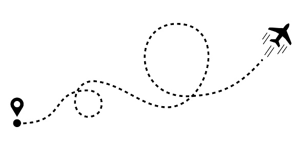

  

## 📖 Description
This app can calculate trajectory of plane to some points and be on needed point with needed parameters of points 

## 📋 Project structure
**The project has an 3-Tier Architecture**
- Service - This level of architecture is responsible for processing the data received from the DAO level.
- Repository - This level of architecture is responsible for communicating with the database.

## 🎯 Features
- Save model
- Calculate trajectory
- Print needed info

## 🖥️ Technologies
- Java 17
- Maven
- MongoDB
- Spring Boot

## ⚡️Quickstart
1. Clone this project
2. Open project in IDE
3. Start project
